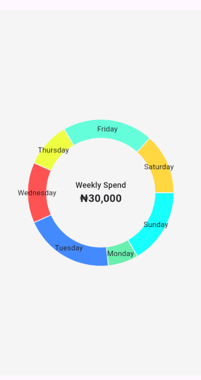

# Pie Chart Implementation

This Flutter project demonstrates a customizable pie chart using the `fl_chart` package. The pie chart displays weekly spending data, with each slice representing a day of the week.

## Features

- Dynamic data: The pie chart adapts to the provided spending values for each day.
- Customizable colors: Each slice is color-coded for easy identification.
- Clear labels: The days of the week are labeled along with their corresponding spending amounts.

## Getting Started

1. Clone this repository to your local machine.
2. Open the project in your preferred IDE (e.g., Visual Studio Code).
3. Run the app on an emulator or physical device.

## Usage

1. Modify the spending values in the `PieChartSectionData` list to match your own data.
2. Customize colors, fonts, and other styles in the `PieChart` widget.
3. Experiment with different layouts and animations to enhance the user experience.

## Screenshots

## Dependencies

- [fl_chart](https://pub.dev/packages/fl_chart): A powerful charting library for Flutter.

## Resources

- [fl_chart repo](https://github.com/imaNNeo/fl_chart)

## License

This project is licensed under the MIT License

---

Feel free to replace the placeholders (such as screenshots and dependencies) with actual content relevant to your project. Happy coding! 🚀
[Learn more](https://pub.dev/packages/fl_chart) about the `fl_chart` package for Flutter.
